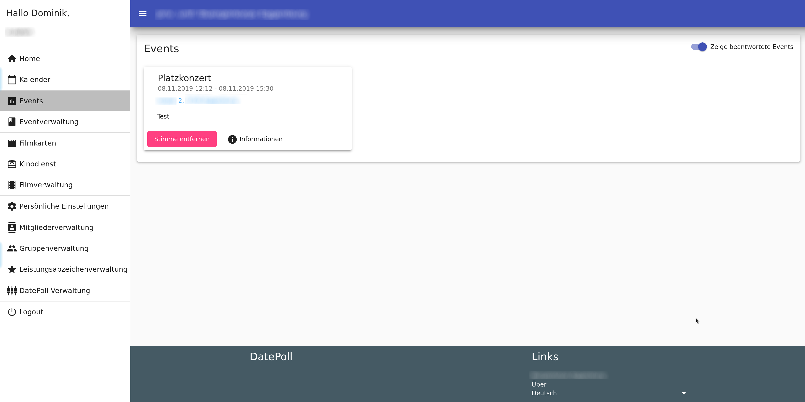

Here are some example screenshots of a running DatePoll application.

## Home / Start page

## Calendar

## Events

## Event info

## Event user management

## Group and subgroup management

## DatePoll management
